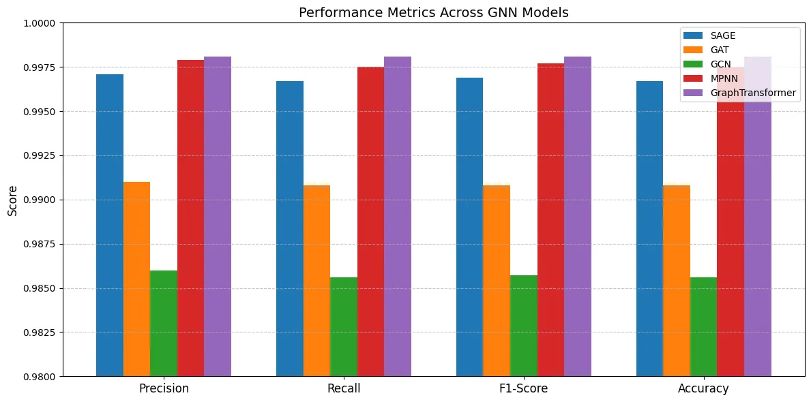
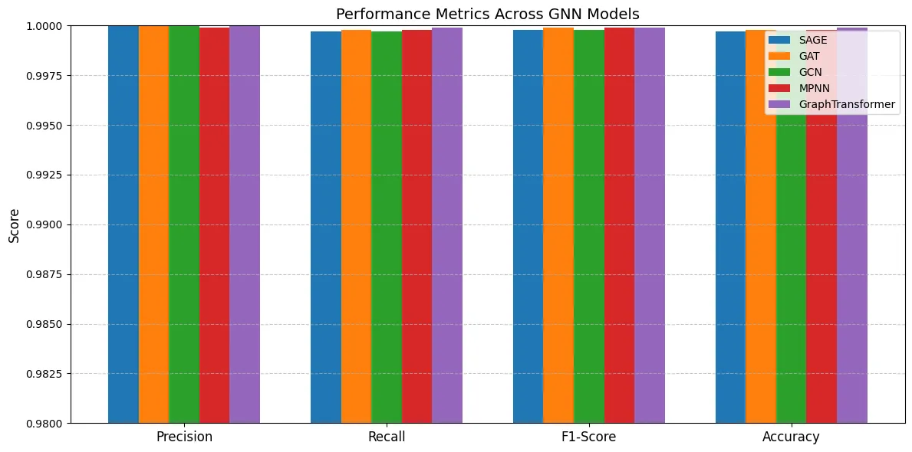

# Graph-Structured Learning for Cyber Intrusion Detection in Electric Vehicle Charging Systems

## Introduction
This project explores the use of graph neural networks (GNNs) and transformer-based graph models for cyber intrusion detection in electric vehicle (EV) charging systems. The system focuses on three types of classifications:
- Multi-classification based on **attack types**.
- Multi-classification based on **scenarios**.
- **Binary classification** for detecting attack and benign traffic.

## Implemented Models
We compare the following graph-based models:
- **GNN-SAGE**
- **GNN-GAT**
- **GNN-GCN**
- **GNN-MPNN**
- **Graph-Transformer**

## **Implementation Strategy**

### 1. **Download Data**
   - **Objective**: Download and prepare the dataset.
   - **Process**:
     - Download raw data files.
     - Merge and preprocess data into a single file: `CICEVSE2024.csv`.
     - Organize the dataset into suitable formats for binary, multi-attack, and multi-scenario classification.

   - **Notebook**: [`Download_Data.ipynb`](./Download_Data.ipynb)

---

### 2. **Network Traffic Classification**

#### **Binary Classification**
   - **Objective**: Classify network traffic as either attack or benign.
   - **Notebook**: [`Network_Traffic_Binary.ipynb`](./Network_Traffic_Binary.ipynb)

#### **Multi-Attack Classification**
   - **Objective**: Identify specific types of network attacks in traffic.
   - **Notebook**: [`Network_Traffic_Multi_Attack.ipynb`](./Network_Traffic_Multi_Attack.ipynb)
      - **Attack Types**: Cryptojacking, Backdoor, None, TCP-port-scan, service-version-detection, os-fingerpriting, aggressive-scan, syn-stealth-scan, vulnerability-scan, slowloris-scan, upd-flood, icmp-flood, pshack-flood, icmp-fragmentation, TCP-flood, syn-flood, synonymousIP-flood

#### **Multi-Scenario Classification**
   - **Objective**: Detect different scenarios of network activity and classify them.
   - **Notebook**: [`Network_Traffic_Multi_Scenario.ipynb`](./Network_Traffic_Multi_Scenario.ipynb)
      - **Scenario Types**: Recon, DoS, Cryptojacking, Backdoor, Benign

---

## Results

### Multi-Classification - Scenario Based
| Model             | Precision | Recall | F1-Score | Accuracy |
|-------------------|-----------|--------|----------|----------|
| GNN-SAGE          | 0.9971    | 0.9967 | 0.9969   | 0.9967   |
| GNN-GAT           | 0.9910    | 0.9908 | 0.9908   | 0.9908   |
| GNN-GCN           | 0.9860    | 0.9856 | 0.9857   | 0.9856   |
| GNN-MPNN          | 0.9979    | 0.9975 | 0.9977   | 0.9975   |
| Graph-Transformer | **0.9981**| **0.9981**| **0.9981**| **0.9981**|

### Multi-Classification - Attack Based
| Model             | Precision | Recall | F1-Score | Accuracy |
|-------------------|-----------|--------|----------|----------|
| GNN-SAGE          | 0.6403    | 0.6297 | 0.6177   | 0.6297   |
| GNN-GAT           | 0.6210    | 0.6042 | 0.5907   | 0.6042   |
| GNN-GCN           | 0.6136    | 0.5840 | 0.5719   | 0.5840   |
| GNN-MPNN          | 0.5332    | 0.5182 | 0.4608   | 0.5182   |
| Graph-Transformer | **0.9837**| **0.9835**| **0.9835**| **0.9835**|

### Binary Classification
| Model             | Precision | Recall | F1-Score | Accuracy |
|-------------------|-----------|--------|----------|----------|
| GNN-SAGE          | **1.0000**| 0.9997 | 0.9998   | 0.9997   |
| GNN-GAT           | **1.0000**| 0.9998 | 0.9999   | 0.9998   |
| GNN-GCN           | **1.0000**| 0.9997 | 0.9998   | 0.9997   |
| GNN-MPNN          | 0.9999    | 0.9998 | 0.9999   | 0.9998   |
| Graph-Transformer | **1.0000**| **0.9999**| **0.9999**| **0.9999**|

## Visualization
### Scenario-Based Multi-Classification

### Attack-Based Multi-Classification

### Binary Classification

## Key Findings
- **Graph-Transformer** consistently outperforms other models across all tasks, achieving the highest precision, recall, F1-Score, and accuracy.
- **Binary Classification** achieves near-perfect results across all models, indicating strong capability for distinguishing malicious from benign traffic.
- **Attack-Based Multi-Classification** highlights significant improvements using the Graph-Transformer compared to traditional GNNs.

## Conclusion
This study demonstrates the superiority of transformer-based graph models for detecting network traffic anomalies in EV charging systems. Future work will explore extending the system to real-time detection and more diverse datasets.
